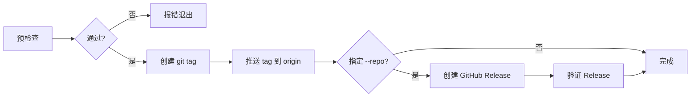

# devops-release

使用 `qtcloud-devops release` 命令发布项目的 GitHub Release。

## 前置条件

- `qtcloud-devops` CLI 已安装（通过 `uv tool install qtcloud-devops-cli`）
- `gh` CLI 已安装并登录
- 当前 git 工作区干净（无未提交变更）
- 当前在 `main`、`master` 或 `release/*` 分支上
- 远程仓库已配置（`git remote -v` 可获取 origin URL）

## 工作流

### 1. 创建或检查 CHANGELOG.md

命令要求 CHANGELOG.md 使用 `## [{ver}]` 格式，其中 `{ver}` 为去掉 `v` 前缀的版本号。

```markdown
# Changelog

## [0.1.0] - 2026-05-22

### 初始化

- 初始化仓库结构
- 添加子模组
```

> **注意**：如果格式不匹配，工具会报错 `CHANGELOG.md 未找到 {ver} 版本记录`。

### 2. 提交并推送 CHANGELOG.md

```bash
git add CHANGELOG.md
git commit -m "docs: 添加 CHANGELOG.md v<版本号>"
git push
```

### 3. 运行发布命令

```bash
# 预检查（推荐先 dry-run 验证）
qtcloud-devops release --version v<版本号> --dry-run

# 正式发布
qtcloud-devops release --version v<版本号> --yes
```

| 选项 | 说明 |
|------|------|
| `--version`, `-V` | **必填**。版本号，如 `v0.1.0` 或 `org/v0.1.0` |
| `--changelog` | CHANGELOG.md 路径，默认 `./CHANGELOG.md` |
| `--repo` | GitHub 仓库，如 `quanttide/quanttide-knowl`。不传则不创建 GitHub Release |
| `--dry-run` | 仅检查，不执行实际操作 |
| `--yes`, `-y` | 跳过确认提示，直接发布 |

### 4. 处理嵌套子模组引用

如果当前仓库是上级主仓库的子模组，发布后还需到上级主仓库更新引用：

```bash
# 在上级主仓库目录执行
cd /path/to/superproject
git add path/to/submodule
git commit -m "chore: 更新 <子模组名> 子模组至 v<版本号>"
git push
```

## 预检查规则

工具在发布前会自动检查以下项目，任一失败则终止：

| 检查项 | 失败条件 |
|--------|----------|
| 版本号格式 | 不符合 `vX.Y.Z` 或 `org/vX.Y.Z` |
| CHANGELOG | 文件不存在或缺少 `## [{ver}]` 条目 |
| Git 标签 | `v<版本号>` 标签已存在 |
| 工作区状态 | 有未提交的变更 |
| 分支名 | 不在 `main` / `master` / `release/*` |

## 执行流程



失败时会自动回滚已推送的标签。

## 示例

### 基本用法

```bash
# 发布 v0.2.0
qtcloud-devops release --version v0.2.0 -y
```

### 指定仓库，跳过确认

```bash
qtcloud-devops release --version v1.0.0 \
    --repo quanttide/quanttide-knowl \
    --yes
```

### 仅预检查

```bash
qtcloud-devops release --version v0.3.0 --dry-run
```

## 常见问题

- **CHANGELOG.md 不存在**：需先创建文件，格式为 `## [{ver}]`
- **标签已存在**：版本号冲突，确认后选择递增版本或删除旧标签
- **主仓库引用未更新**：如在子模组中发布，需同步更新上级主仓库的引用指针
- **Release 创建失败但工具显示成功**：已知 bug，可用 `gh release create` 手动补救
